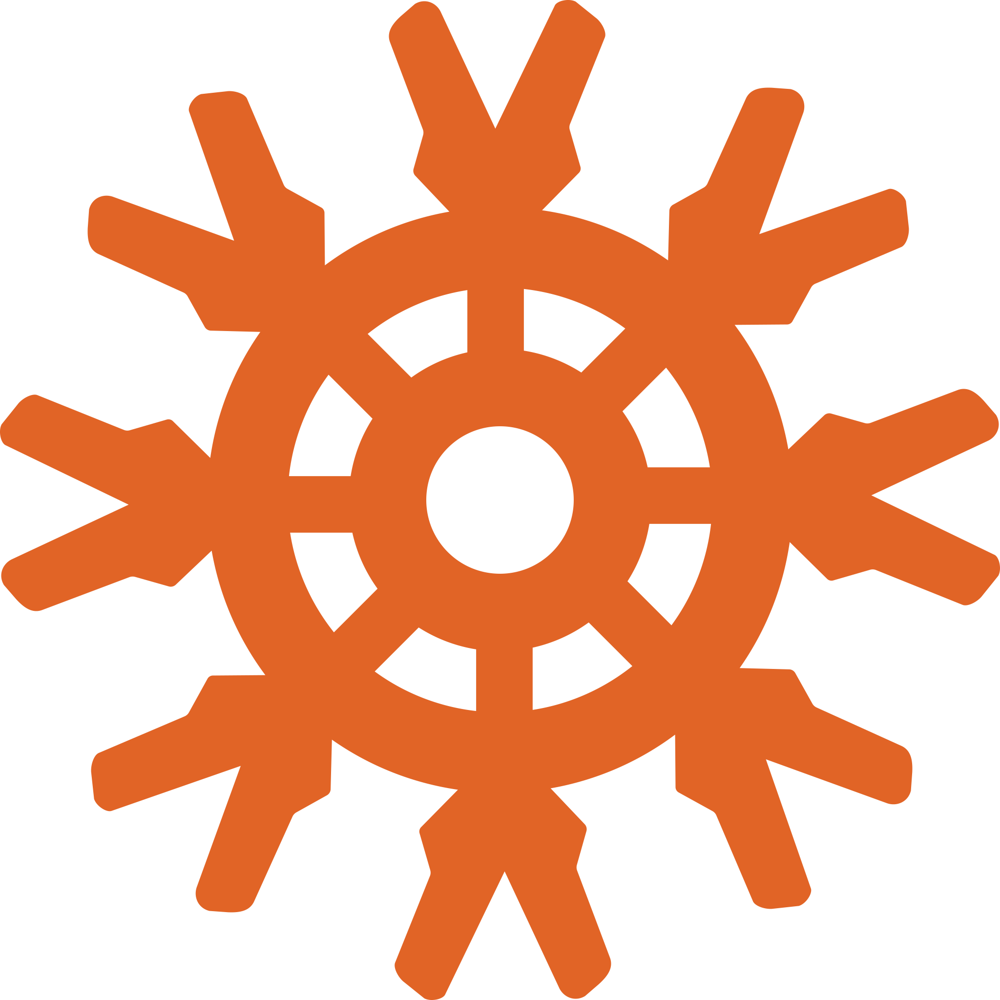
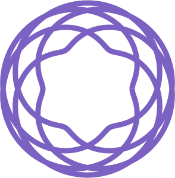

# Hi there :wave: I'm Rodolfo Vieira

---

## About Me
:books: Bachelor degree in Control and Automation Engineering

:computer: Currently working as Designer and Fullstack in IoT Platform

:bulb: IoT lover and developer

:musical_note: Electronic Music lover

:microphone: Podcast Editor

---

## 👨‍💻️ **Technologies** 

### **Languages/Frameworks**
&nbsp;
&nbsp;
&nbsp;
&nbsp;
&nbsp;
&nbsp;
&nbsp;
&nbsp;
&nbsp;

### **Currently Learning**

&nbsp;
&nbsp;
&nbsp;
&nbsp;
&nbsp;
&nbsp;
&nbsp;

### **Favourite Tools/Extensions/Dependencies**

&nbsp;
&nbsp;
&nbsp;
&nbsp;
&nbsp;
&nbsp;
&nbsp;
&nbsp;
&nbsp;
&nbsp;

### **Operational Systems**
&nbsp;
&nbsp;
&nbsp;

---

